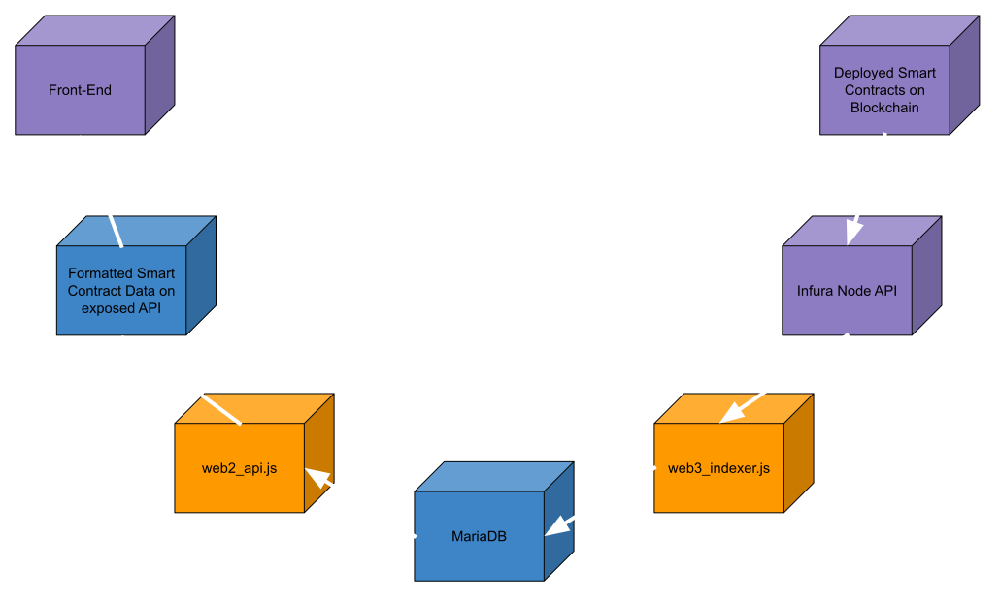

# SpaceDAO Indexer

[Dev README](docs/README_dev.md)

## About the project

This indexer listens for all events executed on a specific smart contract and puts them in a MySQL Database. It is meant to be easy to use (after its completed). This is then meant to be used to interact with quickly for web applications rather than the slower blockchain. All details in the database can be checked against the blockchain at any point to ensure security.
DAO stands for Decentralized Autonomous Organization. And is meant to support Autonomous Orbit Applications and Services.
Space exploration and usage is decentralized by Nature, centralizing it would only bring global tensions. SpaceDAO is a technological approach with conscious geo-political concerns.
It kick started thanks to the Open Space Innovation Platform of the European Space Agency (ESA) as part of the campaign for Cognitive Cloud Computing. The executive summary of the study is publicly visible on ESA's projects listing (called Nebula).
The Indexer is an open source artifact under the LGPL-v-3-0 license.




### Built with

These projects are used to build the indexer:

- [Ethers.js](https://github.com/ethers-io/ethers.js) for connecting to the EVM blockchains
- [MariaDB](https://mariadb.com/) for storing smart contract event data in a database
- [MySQL2.js](https://github.com/sidorares/node-mysql2) for connecting to the MariaDB database
- [Express](https://expressjs.com/) for creating the API that exposes the data in the MariaDB database
- [Docker](https://www.docker.com/) for containerising the project and making it easy to startup

## Usage

### Prerequisites

- Docker Compose `sudo apt install docker-compose`
- You will require a blockchain node api service. I recommend [Infura](https://www.infura.io/)
- Currently designed for ubuntu (however it might work on windows)

### Setup target contract and events

1. Create `.env` file. The database details do not neccessarily need changed however you need to add the blockchain node api urls. Copy the example `.env` file with:
```bash
cp .env-example .env
```

2. Adapt `target.json` based on the contract details, deployed network and event names that you desire to index. An example is given below and with the full abi in `target.json`. More examples are given in `/example_targets/`. `/example_targets/target_big.json` is a contract that has a large amount of calls per second on the mainnet, and `/example_targets/target_small.json` is has a single event call.

```json
{
  "network": "sepolia",
  "address": "0xFF1aae6928D49c3744a81F891621e848914898ed",
  "deploy_block": 7354710,
  "contract_events": ["ContractCreated"],
  "abi": [...]
}
```

### Install npm packages

This will install all required npm packages in `/node_modules/`. The versions of the packages can be seen in `package.json`

```bash
npm install
```

### Start Indexer

Running `up` will start indexer, while running `down` will make sure it is fully stopped.

```bash
sudo docker-compose up
sudo docker-compose down
```

### Reset Indexer

Make sure the `sudo docker-compose down` has been run to fully stop the indexer. Running `ls` will show the VOLUME_NAME for the the `rm` command to remove all contents of the database.

```bash
sudo docker volume ls
sudo docker volume rm VOLUME_NAME
```

## Licensing

This work is licensed under the GNU LESSER GENERAL PUBLIC LICENSE version 3 and above. All contributors accepts terms of this license. See LICENSE for more information.